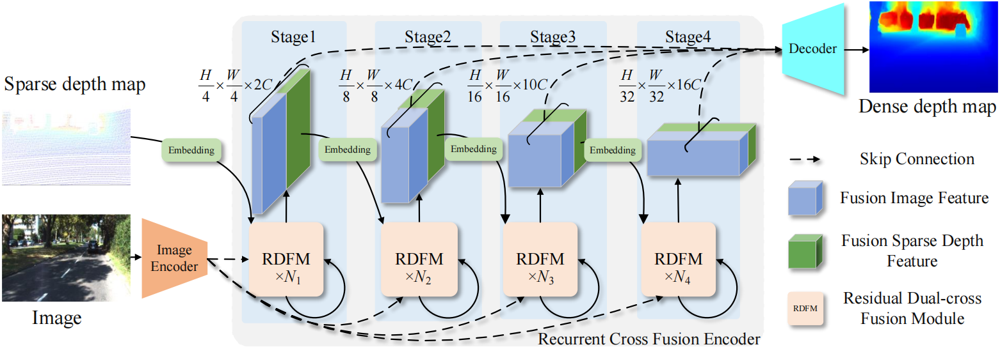
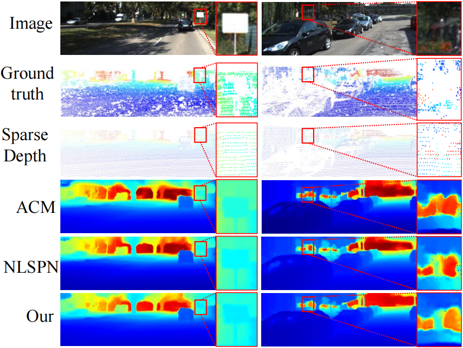
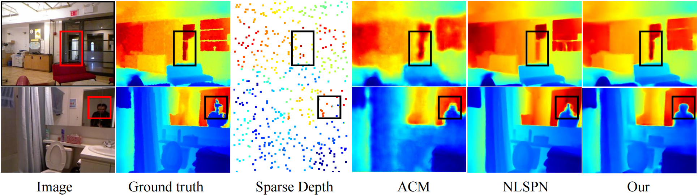

# RCDformer Partial Code Release Statement
Thank you for your interest in our work. Please forgive us for only releasing part of the core code at this time, as our paper has not yet been accepted.
When the paper is accepted, we will release our code. 
## Currently Released Code

We have made the following code available:
- **[BCAP-Net](models/model.py)**
- **[RCF Encoder](models/rcf_encoder.py)**
- **[HMDA Decoder](models/model.py)**

## Method
The overall architecture of the recurrent cross-fusion depth-aware network.

<!--
The quantitative comparison of results with other methods on the KITTI test dataset.
| Method | RMSE$\downarrow$ (mm) | iRMSE$\downarrow$ (1/km) |MAE$\downarrow $(mm) | iMAE$\downarrow $(1/km) |
| :-------- | :----- | :-------- |:-------- |:-------- |
| FuseNet | 752.88    | 2.34   | 221.19| 1.14 |
| ACMNet  | 744.91    | 2.08   | 206.09| 0.90 |
| CSPN++  | 743.69    | 2.07   | 209.28| 0.90 |
|Xu et al.| 742.73    | 2.07   | 209.28| 0.96 |
| GuideNet| 736.24    | 2.25   | 218.83| 0.99 |
| MFF-Net | 719.85    | 2.21   | 208.11| 0.94 |
|   Our   | 685.97    | 1.90   | 196.32| 0.87 |

The quantitative comparison of results with other methods on the NYU depth V2 dataset.
| Method | RMSE$\downarrow$ (mm) | REL$\downarrow$(m)|$\delta_1.25(\%)\uparrow $|$\delta_{1.25^2}(\%)\uparrow $|$\delta_{1.25^3}(\%)\uparrow $|
| :-------- | :----- | :-------- |:-------- |:-------- |:-------- |
| DeepLiDAR | 0.115 |0.022 | 99.3  | - |- |
| ACMNet  | 0.105 |0.015 | 99.4| 99.9|100 |
| CSPN++  | 0.115 | -| - | -|- |
|Xu et al.| 0.092| 0.013 | 99.6 | 99.9|100 |
| GuideNet| 0.101 |0.015 |99.5 |-|- |
| MFF-Net |  0.100 |0.015 |99.5 |99.9|100 |
|   Our   | 0.089 |0.011 |99.6 |100 |100|
-->
## Results
The qualitative comparison results on the KITTI dataset.

The qualitative comparison results on the NYU depth v2 dataset.

